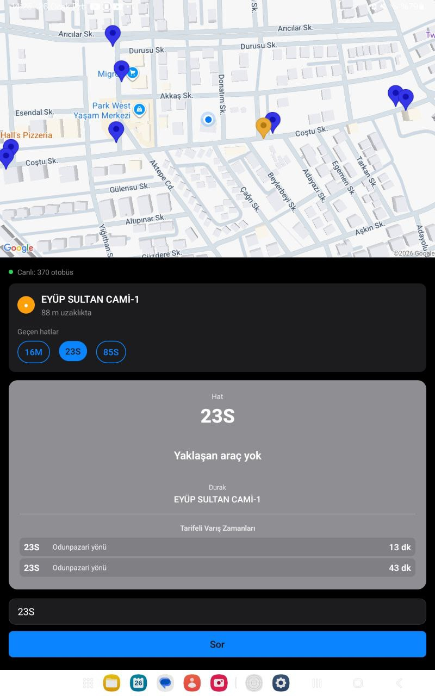

<div align="center">
  
  <h1>Eskişehir Ulaşım</h1>
  <p>Otobüs, tramvay ve dolmuş yolculukları için açık kaynaklı mobil ulaşım rehberi.</p>
</div>

Yakındaki durağı bulur, seçilen hattın ne zaman geleceğini hesaplar, toplu taşıma güzergâhlarını haritada gösterir ve farklı ulaşım türlerini birleştiren yolculuk seçenekleri üretir.

<p align="center">
  
</p>

## Neler sunuyor?

### Otobüs

- Canlı araç konumları ve hat bazlı harita görünümü
- Kullanıcıya en yakın uygun durağın otomatik bulunması
- Gidiş ve dönüş yönü seçimi
- Canlı araç verisi ile rota bazlı kalan süre hesabı
- Canlı araç bulunmadığında Nimbus tarifeli varış bilgisi
- ETA sonucunu sesli okuma

### Tramvay

- Eskişehir tramvay ağı ve hat güzergâhları
- En yakın tramvay durağının bulunması
- Kullanılabildiğinde canlı Nimbus geçiş bilgileri
- Canlı veri olmadığında tarife ve durak sürelerine dayalı tahminler

### Dolmuş

- Kırmızı 23, Mavi 23, Yeşil 23, Siyah 5 ve Kırmızı 19 hatları
- Yönlere ayrılmış güzergâh seçimi
- Harita üzerinde gerçek rota geometrisi
- Hafta içi, cumartesi ve pazar hareket saatleri
- Kullanıcının rotaya en yakın konumu için yaklaşık geçiş süresi

### Yolculuk planlama

- Mevcut konumdan veya seçilen başlangıç noktasından rota oluşturma
- Durak arayarak ya da haritadan hedef seçme
- Otobüs, tramvay ve dolmuş seçeneklerini birlikte değerlendirme
- Doğrudan veya tek aktarmalı yolculuk alternatifleri
- Yürüme, bekleme ve araç içi süreleriyle yaklaşık toplam süre

## Veri yaklaşımı

Uygulama tek bir kaynağa bağlı kalmak yerine canlı ve statik verileri birlikte kullanır:

- Otobüs konumları MQTT üzerinden alınır.
- Nimbus, otobüs ve tramvay için canlı veya tarifeli varış kaynağı olarak kullanılır.
- OpenStreetMap verileri harita, tramvay ağı ve güzergâh geometrilerinde kullanılır.
- Yerel tarife ve rota verileri, canlı servislerin cevap vermediği durumlarda devamlılık sağlar.
- Dolmuş geçişleri, bilinen hareket saatleri ile rota üzerindeki zaman noktalarından yaklaşık olarak hesaplanır.

Canlı servislerin erişilemediği anlarda uygulama uygun olduğu yerde tarifeli tahmine veya liste görünümüne geçer. Gösterilen sürelerin trafik, veri gecikmesi ve işletme koşullarına göre değişebileceği unutulmamalıdır.

## Mevcut veri kapsamı

| Veri | Adet |
| --- | ---: |
| Otobüs durağı | 2.748 |
| Otobüs rotası | 114 |
| Tramvay durağı | 135 |
| Tramvay hattı | 10 |
| Dolmuş güzergâh kaydı | 7 |
| Transit graph durağı | 2.919 |
| Transit pattern | 299 |
| Aktarma bağlantısı | 4.619 |

## Teknik yapı

| Teknoloji | Kullanım |
| --- | --- |
| Expo SDK 54 | Mobil geliştirme ve EAS build altyapısı |
| React Native 0.81 | Android ve iOS arayüzü |
| TypeScript | Uygulama ve servis katmanlarında tip güvenliği |
| React Native WebView + Leaflet | Varsayılan OpenStreetMap görünümü |
| react-native-maps | İsteğe bağlı Google Maps sağlayıcısı |
| MQTT | Canlı otobüs konumları |
| Wialon/Nimbus | Canlı ve tarifeli durak verileri |
| expo-location | Kullanıcı konumu ve yakın durak hesabı |
| expo-speech | ETA sonucunun seslendirilmesi |

## Proje yapısı

```text
src/
├── components/       Arayüz bileşenleri, haritalar ve dolmuş ekranları
├── data/             Durak, rota, tarife ve transit graph verileri
├── hooks/            Konum, durak ve canlı araç hook'ları
├── screens/          Ana ekran, otobüs, tramvay ve rota planlayıcı
├── services/         ETA, MQTT, Nimbus, tramvay ve yolculuk servisleri
├── theme/            Renk, tipografi ve ölçü sistemi
├── types/            Ortak TypeScript tipleri
└── utils/            Coğrafi hesaplar ve veri yardımcıları
```

## Kurulum

Gereksinimler:

- Node.js 18 veya üzeri
- npm
- Android Studio / Android SDK veya iOS için Xcode
- Dağıtım build'leri için EAS CLI

Bağımlılıkları yükleyin:

```bash
npm install
```

Geliştirme sunucusunu başlatın:

```bash
npm run start
```

Platform komutları:

```bash
npm run android
npm run ios
npm run web
```

## Ortam değişkenleri

Proje kökünde bir `.env` dosyası oluşturabilirsiniz:

```env
EXPO_PUBLIC_MAP_PROVIDER=osm
EXPO_PUBLIC_MAP_TILE_URL=https://tile.openstreetmap.org/{z}/{x}/{y}.png
EXPO_PUBLIC_GOOGLE_MAPS_API_KEY=

FLESPI_CHANNEL_ID=
FLESPI_DEVICE_IDS=

NIMBUS_LOCATOR_HASH=
EXPO_PUBLIC_TRAM_NIMBUS_LOCATOR_HASH=
```

OpenStreetMap varsayılan sağlayıcıdır ve Google Maps anahtarı gerektirmez. Google Maps kullanmak için `EXPO_PUBLIC_MAP_PROVIDER=google` ile birlikte geçerli bir `EXPO_PUBLIC_GOOGLE_MAPS_API_KEY` tanımlanmalıdır.

## Doğrulama

```bash
npm run typecheck
npm run check:transit-graph
npm run benchmark:transit-routing
```

Transit verisini yeniden üretip tüm kontrolleri çalıştırmak için:

```bash
npm run validate:transit
```

## Android build

EAS ile dahili APK oluşturmak için:

```bash
npm run build:apk
```

`development`, `preview` ve `production` build profilleri [eas.json](eas.json) içinde tanımlıdır.

## Veri notu

Bu proje resmî bir belediye uygulaması değildir. Canlı konumlar ve tahmini varış süreleri bilgilendirme amaçlıdır; servis kesintileri, trafik ve işletme değişiklikleri sonuçları etkileyebilir.
